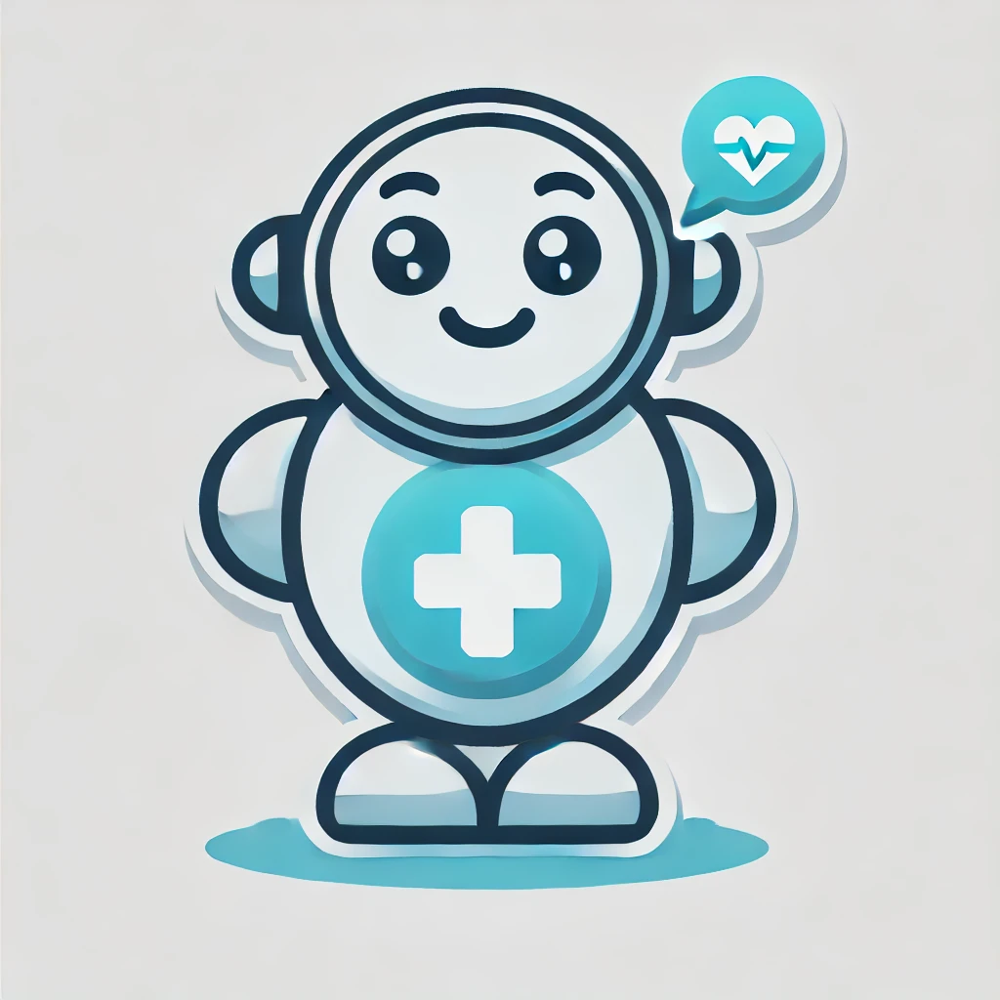

# Baya: bridging the gap in patient recovery 

 
Baya is a personal health assistant, designed to assist patients in recovering from surgeries, illnesses and more. Friendly and helpful, Baya is designed to make recovery as simple a process as possible. Baya is designed to be deployed by healthcare professionals with curated datasets to help their patients, with information on their past appointments, treatments and any other necessary notes. Baya is not designed to be a replacement for a healthcare professional, but instead a easy to use data source for query answering of carefully preselected topics. Baya grounds her knowledge in the data retrieved, and when she can't find a response to the user's query in the provided manual, or if the manual instructs her to, she refers the user to a healthcare professional, offering to book appointments or make a telehealth call.

## Design

Baya is powered by IBM WatsonX. A flask backend powers the chroma database for efficient retrieval-augmented generation, while NextJS provides the frontend and the inference. In addition to text generation, the large language model can call functions, which allow it to book appointments or make an emergency call. The frontend UI was designed with the help of TailwindCSS and shadcn. A SQLite database is used to store user data with the Prisma ORM.

Chat with Baya now: [Demo](https://baya-healthcare-assistant-tau.vercel.app/)